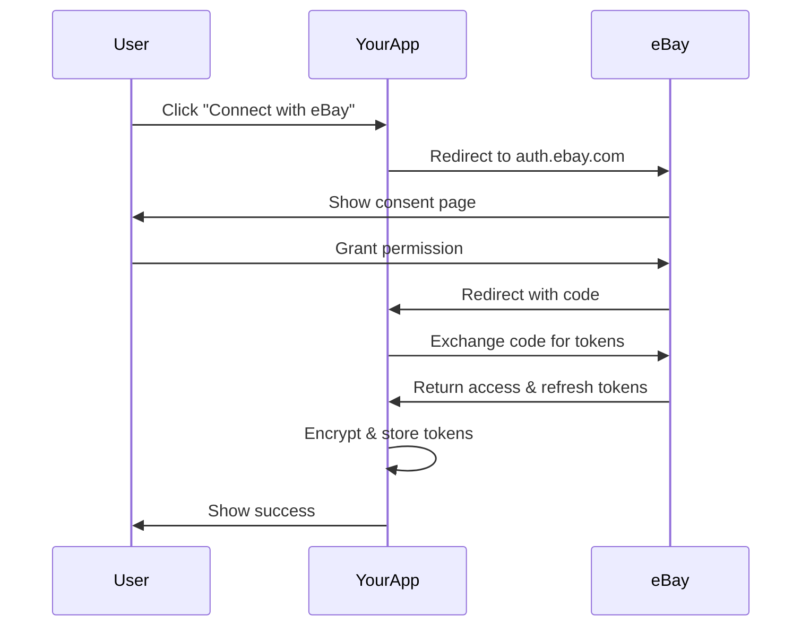

# eBay OAuth 2.0 Setup Guide

This guide will walk you through setting up eBay OAuth 2.0 authentication for your FastAPI application.

## 📋 Prerequisites

1. **eBay Developer Account**: Sign up at https://developer.ebay.com
2. **Production App Keys**: Create an app and get production keys
3. **Railway Account**: For deployment (or any other hosting service)

## 🔧 Step 1: Configure eBay Developer Console

### 1.1 Create/Configure Your App

1. Log in to [eBay Developer Program](https://developer.ebay.com)
2. Go to **Your Account > Application Keys**
3. Create a new application or use existing one
4. Note down your:
   - **App ID (Client ID)**: `sabrikut-Revolist-PRD-78e9ff002-ebe55bcd`
   - **Cert ID (Client Secret)**: Keep this secret!

### 1.2 Generate RuName (CRITICAL STEP!)

1. Click **User Tokens** next to your App ID
2. Click **Get a Token from eBay via Your Application**
3. If no RuName exists, click **"You have no Redirect URLs. Click here to add one"**
4. Fill out the form:
   - **Display Title**: "eBay Dropshipping Spy"
   - **Privacy Policy URL**: Your privacy policy URL
   - **Auth Accepted URL**: `https://ebat-drop-shipping-spy-production.up.railway.app/auth/ebay/callback`
   - **Auth Declined URL**: `https://ebat-drop-shipping-spy-production.up.railway.app/?auth_status=declined`
5. Save and copy your RuName (looks like: `sabri_kutay_kar-sabrikut-Revoli-vsmmkky`)

## 🔐 Step 2: Environment Variables

### 2.1 Generate Encryption Key

Run the provided script:
```bash
python generate_encryption_key.py
```

### 2.2 Set Environment Variables

In Railway (or your hosting platform), set these variables:

```env
# eBay OAuth Credentials
EBAY_CLIENT_ID=sabrikut-Revolist-PRD-78e9ff002-ebe55bcd
EBAY_CLIENT_SECRET=PRD-8e9ff002eb75-[your-actual-cert-id]
EBAY_REDIRECT_URI=sabri_kutay_kar-sabrikut-Revoli-vsmmkky

# Security
ENCRYPTION_KEY=nC2fUoThgOOQheygRPjbdWImS528GQYUAqpzLa4-S7A=

# Database
DATABASE_URL=postgresql://[your-database-url]
```

## 🚀 Step 3: Deploy and Test

### 3.1 Deploy to Railway

```bash
git add .
git commit -m "Configure eBay OAuth"
git push origin main
```

### 3.2 Test OAuth Flow

1. **Check Configuration**:
   ```
   https://your-app.railway.app/debug/oauth-url
   ```

2. **Test Authentication**:
   - Visit: `https://your-app.railway.app/connect/ebay`
   - You should be redirected to eBay login
   - After consent, redirected back to your app
   - Check status: `https://your-app.railway.app/auth/ebay/status`

## 📝 OAuth Flow Overview



## 🔑 Key Endpoints

### Authentication
- `GET /connect/ebay` - Start OAuth flow
- `GET /auth/ebay/callback` - Handle eBay redirect
- `GET /auth/ebay/status` - Check connection status
- `POST /auth/ebay/disconnect` - Remove stored tokens

### eBay API Examples
- `GET /api/ebay/inventory` - Get user's inventory
- `GET /api/ebay/orders` - Get user's orders
- `GET /ebay/profile` - Get user's profile

### Debug
- `GET /debug/oauth-url` - Debug OAuth configuration

## 🛡️ Security Features

1. **Token Encryption**: All tokens encrypted with Fernet
2. **Automatic Refresh**: Tokens refreshed automatically when expired
3. **Multi-User Support**: Each user's tokens stored separately
4. **Secure Storage**: Tokens never logged or exposed

## 🐛 Troubleshooting

### "invalid_request" Error
- Verify RuName is correctly configured in eBay Developer Console
- Check that Auth Accepted URL matches your callback URL
- Ensure all environment variables are set

### Token Refresh Issues
- Check refresh token hasn't expired (18 months validity)
- Verify scopes haven't changed
- Check eBay API status

### Connection Issues
- Verify HTTPS is used for all URLs
- Check Railway deployment logs
- Test with debug endpoint first

## 📚 Additional Resources

- [eBay OAuth Documentation](https://developer.ebay.com/api-docs/static/oauth-tokens.html)
- [eBay Sell APIs](https://developer.ebay.com/api-docs/sell/static/seller-accounts.html)
- [FastAPI Security](https://fastapi.tiangolo.com/tutorial/security/)

## 🤝 Support

If you encounter issues:
1. Check Railway logs
2. Use `/debug/oauth-url` endpoint
3. Verify all environment variables
4. Check eBay Developer Console settings 